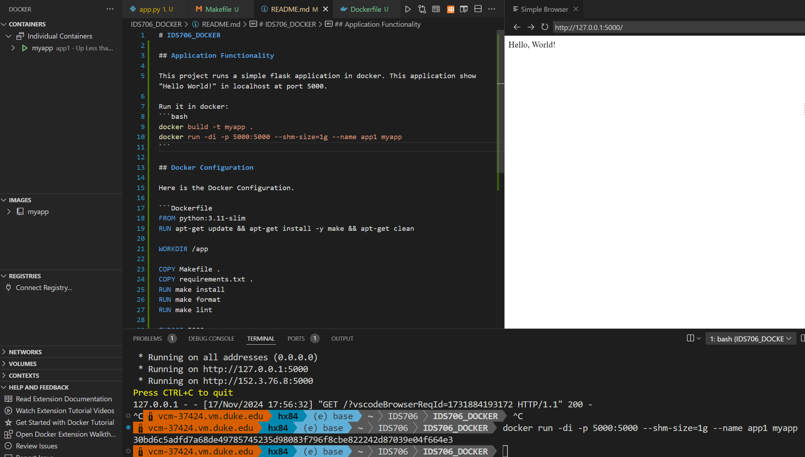

# IDS706_DOCKER


## Link to the docker image
You can find the docker image [here](https://hub.docker.com/r/hongji1001/myapp)

## Application Functionality

This project runs a simple flask application in docker. This application show "Hello World!" in localhost at port 5000.

Run it in docker:
```bash
docker build -t myapp .
docker run -di -p 5000:5000 --shm-size=1g --name app1 myapp
```

Output


## Docker Configuration

Here is the Docker Configuration.

```Dockerfile
FROM python:3.11-slim
RUN apt-get update && apt-get install -y make && apt-get clean

WORKDIR /app

COPY Makefile .
COPY requirements.txt .
RUN make install
RUN make format
RUN make lint

EXPOSE 5000

CMD ["make", "run"]
```

## CICD

In [CICD](./.github/workflows/CICD.yml), it will automatically build and upload the docker image.